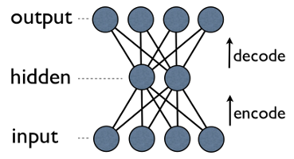

# Simple Autoencoder in TensorFlow

There are many times of the Autoencoder architectures, this is the implementation of the Simple Autoencoder. With Fully connected layers for the Encoder and Decoder part.

## Dataset

MNIST dataset is used to test the Autoencoder. You can import it by using Tensorflow built-in functions.

## Install

### &nbsp;&nbsp;&nbsp; Supported Python version
&nbsp;&nbsp;&nbsp;&nbsp;&nbsp;&nbsp;&nbsp;&nbsp;&nbsp;- Python version used in this project: 3.5+

### &nbsp;&nbsp;&nbsp; Libraries used

> *  [Tensorflow](http://tensorflow.org) 1.2.0
> *  [Numpy](http://www.numpy.org) 1.10.4
> *  [Matplotlib](https://matplotlib.org) 1.5.1

## Code

The main code used in this project is inside **simple_autoencoder.ipynb**.

There is file called **autoencoders_helper_functions.py**, in this file you will find all helper functions (layers, preprocessing) used in the main code file.

## Run

To run this project you will need some software, like Anaconda, which provides support for running .ipynb files (Jupyter Notebook).

After making sure you have that, you can run from a terminal or cmd next lines:

`ipython notebook simple_autoencoder.ipynb`

or

`jupyter notebook simple_autoencoder.ipynb`

Helper code:

To run the file with helper code execute next line in the terminal:

`python autoencoders_helper_functions.py`

## License

MIT License

Copyright (c) 2017 Luka Anicin

Permission is hereby granted, free of charge, to any person obtaining a copy
of this software and associated documentation files (the "Software"), to deal
in the Software without restriction, including without limitation the rights
to use, copy, modify, merge, publish, distribute, sublicense, and/or sell
copies of the Software, and to permit persons to whom the Software is
furnished to do so, subject to the following conditions:

The above copyright notice and this permission notice shall be included in all
copies or substantial portions of the Software.

THE SOFTWARE IS PROVIDED "AS IS", WITHOUT WARRANTY OF ANY KIND, EXPRESS OR
IMPLIED, INCLUDING BUT NOT LIMITED TO THE WARRANTIES OF MERCHANTABILITY,
FITNESS FOR A PARTICULAR PURPOSE AND NONINFRINGEMENT. IN NO EVENT SHALL THE
AUTHORS OR COPYRIGHT HOLDERS BE LIABLE FOR ANY CLAIM, DAMAGES OR OTHER
LIABILITY, WHETHER IN AN ACTION OF CONTRACT, TORT OR OTHERWISE, ARISING FROM,
OUT OF OR IN CONNECTION WITH THE SOFTWARE OR THE USE OR OTHER DEALINGS IN THE
SOFTWARE.
